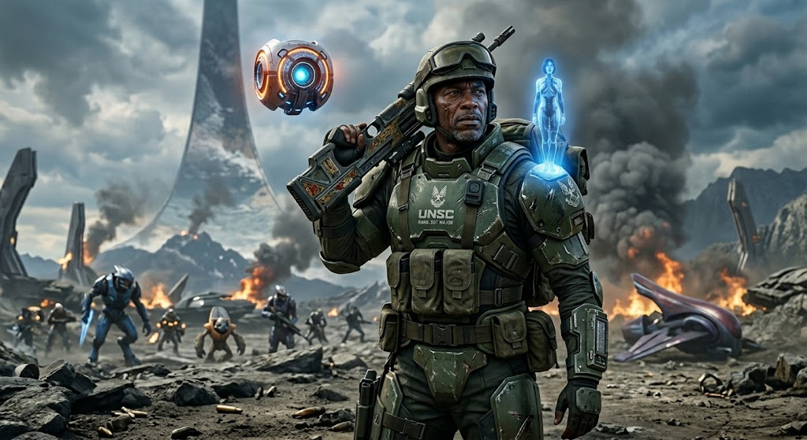

# Halo Audio Hooks



Halo voice-line sound packs for Claude Code event hooks. Sibling to
[`claude-audio-hooks`](https://github.com/samhayek-code/claude-audio-hooks)
(the StarCraft 2 packs) — shares the same scripts and the live install at `~/.claude/sounds/`.
Think of it as an expansion: install the base, drop these packs in alongside, switch freely.

## Install

Standalone — no other repo required (macOS; uses `afplay`). One-liner:

```bash
bash <(curl -fsSL https://raw.githubusercontent.com/samhayek-code/halo-audio-hooks/main/install.sh)
```

Or clone and run `./install.sh`. It deploys the packs + scripts to `~/.claude/sounds/`,
merges the event hooks into `~/.claude/settings.json` (backed up first), and lets you pick a
starting voice. Start a new Claude Code session to hear it. Remove with `./uninstall.sh`.

Installs **additively** — if the SC2 base ([`claude-audio-hooks`](https://github.com/samhayek-code/claude-audio-hooks))
is already installed, this drops in alongside it and you switch across all packs with
`set-faction.sh`. Uninstalling Halo leaves the SC2 packs and shared hooks intact.

## Packs

| Pack | Character | Source |
|------|-----------|--------|
| `cortana` | Cortana (Halo 2/3) | 101soundboards |
| `guilty-spark` | 343 Guilty Spark (Halo 3) | 101soundboards |
| `sergeant-johnson` | Sgt. Johnson | 101soundboards |

Each pack is a folder of four event buckets: `session-start`, `task-complete`,
`needs-permission`, `error`. `play-random.sh` picks a random clip from the active
pack's bucket on each event.

## Use

```bash
~/.claude/sounds/set-faction.sh cortana        # or guilty-spark, sergeant-johnson
~/.claude/sounds/set-faction.sh protoss        # back to SC2 (claude-audio-hooks)
```

`set-faction.sh` auto-discovers any pack folder in `~/.claude/sounds/`, so SC2 and
Halo packs coexist; the `active` symlink selects which one plays.

## Cleaning pipeline (`tools/`)

Raw 101soundboards rips carry artifacts that these scripts strip (in order applied):

1. **`fadefix.py`** — trims leading dead air + a 10 ms fast-attack fade-in (kills startup clicks).
2. **`debeep.py` / `unified2.py`** — removes the in-game radio/COM **ping** (5-6 fixed
   variants) and the spoken **"101soundboards" plug** that precede the voice line.
   `cluster.py` groups clip openings by cross-correlation to identify the recurring
   ping variants vs. real speech, so real first words are never cut.
3. Manual per-clip trims for stragglers + dedup (same line that landed in two buckets —
   keep the clean copy, delete the redundant pinged one).

Requires `numpy` + `ffmpeg`. Detection is acoustic (region/energy + cross-correlation),
verified by ear. Re-run after pulling new clips, since fresh rips reintroduce the ping/plug.

## Credits

- Voice clips sourced from [101soundboards](https://www.101soundboards.com)
- Halo, Cortana, 343 Guilty Spark, and Sergeant Johnson are trademarks of Microsoft / 343 Industries; the franchise was created by Bungie
- Cover art is AI-generated fan art

## License & disclaimer

MIT — **the code and tooling, not the audio**. The Halo voice clips are the property of
Microsoft / 343 Industries and are included here for personal, non-commercial, fan use only.
This project is unofficial and not affiliated with or endorsed by Microsoft, 343 Industries,
or Bungie. If you represent a rights holder and want clips removed, open an issue and they'll
be taken down.
